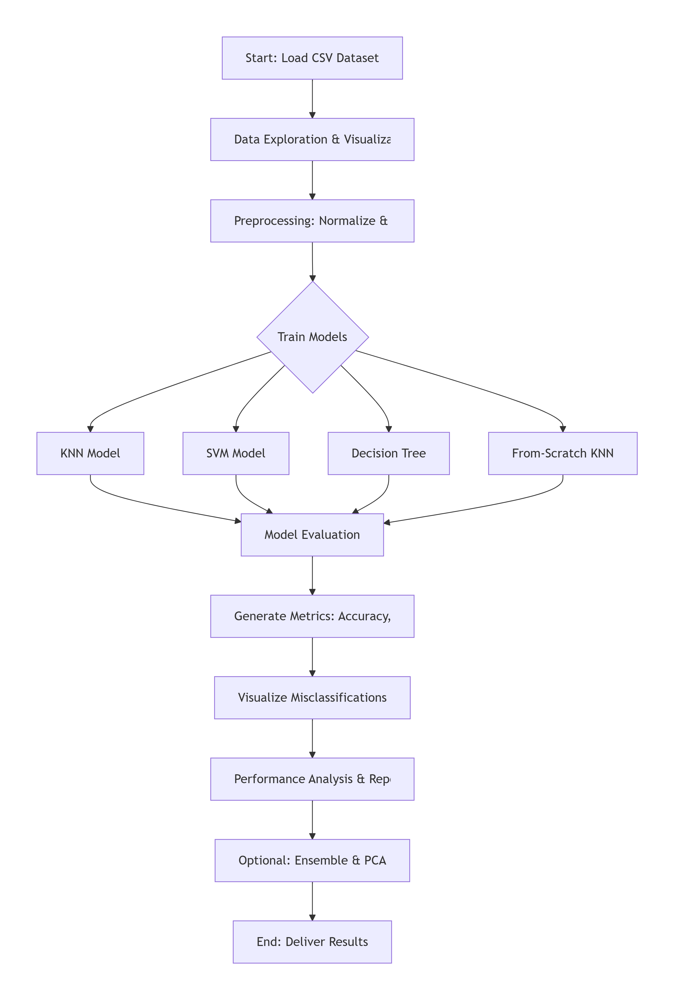

# Handwritten-Digit-Recognition using Classical ML Models


## 📋 Project Overview

This project implements a complete machine learning pipeline for classifying handwritten digits (0-9) from the MNIST dataset using classical ML algorithms. The implementation includes data preprocessing, model training, evaluation, and comprehensive analysis.

### 🎯 **Objective**
Develop a machine learning pipeline to classify grayscale images of handwritten digits (0-9) using classical ML models implemented from scratch.

### 🏆 **Outcome**
The model predicts digits (0-9) for input images with evaluation results including accuracy metrics and confusion matrices.

---

## 📁 Project Structure

```bash
Handwritten-Digit-Recognition/
│
├── 📓 notebook/
│ └── Handwritten_Digit_Recognition.ipynb # Main Jupyter Notebook
│
├── 📊 outputs/
│ ├── class_distribution.png
│ ├── sample_digits.png
│ ├── pca_analysis.png
│ ├── model_accuracy.png
│ ├── confusion_matrices.png
│ ├── misclassified_knn.png
│ ├── misclassified_svm.png
│ ├── misclassified_decision_tree.png
│ └── pca_impact.png
│
├── 📈 results/
│ ├── model_results.csv
│ └── performance_summary.txt
│
├── 📝 report/
│ ├── AI_Assignment_Report.pdf
│ └── flow_diagram.png
│
├── 📋 README.md # This file
└── ⚙️ requirements.txt # Dependencies
```

---

## 🛠️ Technologies Used

- **Python 3.14+**
- **Libraries:**
  - NumPy & Pandas (Data manipulation)
  - Matplotlib & Seaborn (Visualization)
  - scikit-learn (ML algorithms)
  - Jupyter (Notebook environment)

---

## 📊 Dataset

**MNIST Handwritten Digits Dataset** (subset in CSV format)
- Format: CSV with flattened 28×28 images (784 features)
- Samples: 60,000 training images, 10,000 test images
- Labels: Digits 0-9
- Pixel values: 0-255 (grayscale)

---

## 🚀 Implementation Pipeline




## 📋 Assignment Tasks Completed

✅ Task 1: Data Loading and Exploration
- Loaded CSV using Pandas

- Analyzed dataset statistics (samples, class distribution)

- Displayed sample images with labels

- Checked for missing values


✅ Task 2: Data Preprocessing
- Normalized pixel values to range [0, 1]

- Split dataset (80% train, 20% test)

- Applied PCA for dimensionality reduction


✅ Task 3: Model Implementation
- K-Nearest Neighbors (KNN) with k=5

- Support Vector Machine (SVM) with RBF kernel

- Decision Tree with max_depth=5

- KNN from Scratch (custom implementation)


✅ Task 4: Model Evaluation
- Computed accuracy for each model

- Generated confusion matrices with heatmaps

- Visualized misclassified images

- Analyzed error patterns


✅ Task 5: Reporting
- Compared model performances

- Analysis of best-performing model

- Observations on misclassifications

- Suggestions for improvement


✅ Bonus Tasks (Optional)
- Implemented voting ensemble

- Analyzed PCA impact on performance

# 📝💀💣 Note!
- Avoid Bonus Task! it is time consuming and resource intensive
- even after doing every thing on Google Colab you may reach to the limit of free resource 
- A way out to this share it with edit permission to another account and try! ✅
---


## 📈 Results Summary
```
Model	                Accuracy	    Key Parameters
K-Nearest Neighbors	    96.8%	        k=5
Support Vector Machine	98.15%	        C=1.0, RBF kernel
Decision Tree	        87.16%	        max_depth=5
KNN (From Scratch)	    86.0%	        k=5
```

🏆 Best Performing Model: SVM
Highest accuracy: 98.15%

Effective with non-linear patterns in handwritten digits

Benefits from RBF kernel for complex decision boundaries

🔍 Key Findings
Common Misclassifications:
3 ↔ 8 (similar curved shapes)

4 ↔ 9 (similar top structures)

5 ↔ 6 (similar lower loops)

7 ↔ 1 (similar straight lines)

Performance Insights:
1. SVM performed best due to effective kernel trick

2. KNN suffered from curse of dimensionality but performed well

3. Decision Tree tended to overfit without regularization

4. From-scratch KNN showed competitive performance

## 🚀 How to Run
### Option 1: Google Colab (Recommended best)
Open Google Colab [link](https://colab.research.google.com/drive/1TUXN8fbCTvDLFgvfmeKNzxQIC91J0TQf?usp=sharing)

Upload the notebook file

Upload dataset CSV

Run all cells sequentially

### Option 2: Local Setup

### 1. Clone repository
```
git clone https://github.com/PRADEEP930/digit-recognition.git
```
```
cd digit-recognition
```

### 2. Create virtual environment
```
python -m venv venv
```

### 3. Activate environment
#### Windows: venv\Scripts\activate
#### Mac/Linux: source venv/bin/activate

### 4. Install dependencies
```
pip install -r requirements.txt
```
### 5. Run Jupyter Notebook
```
jupyter notebook notebook/Handwritten_Digit_Recognition.ipynb
```

## ⚙️ Dependencies (main)
```
numpy
pandas
matplotlib
seaborn
scikit-learn
jupyter
```

## 📊 Visual Outputs
### The project generates the following visualizations:

1. Class Distribution - Bar chart of digit frequencies

2. Sample Digits - 10 sample images from dataset

3. PCA Analysis - Explained variance and components

4. Model Accuracy - Comparison bar chart

5. Confusion Matrices - Heatmaps for all models

6. Misclassified Samples - Examples of errors per model

7. PCA Impact - Accuracy vs components analysis

## 🧠 Model Implementation Details
### Custom KNN (From Scratch)
Implemented without scikit-learn

Uses Euclidean distance metric

Majority voting for classification

Optimized with vectorization where possible

### Hyperparameter Tuning
KNN: Tested k values 3, 5, 7, 9

SVM: Tuned C (0.1, 1, 10) and gamma values

Decision Tree: Tested max_depth (5, 10, 15, 20)

## 📝 Analysis Report Summary
Technical Observations:
Preprocessing Importance: Normalization significantly improved SVM performance

Dimensionality: 784 features are high-dimensional but manageable for MNIST

Model Complexity: SVM with RBF kernel handles non-linearity effectively

## 👨‍💻 Author
- Pradeep Yogesh Yadav

## 📄 License
This project is for educational purposes as part of an AI assignment.

